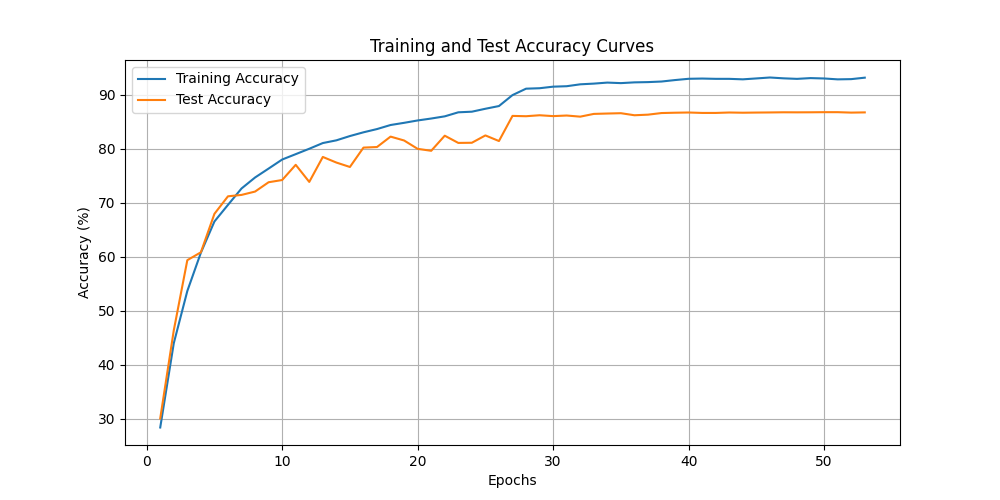
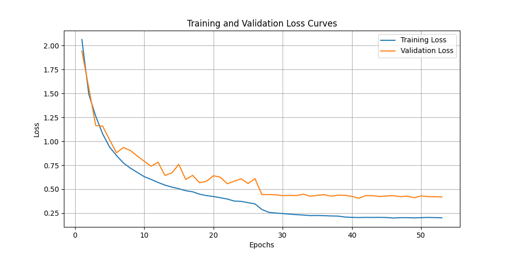
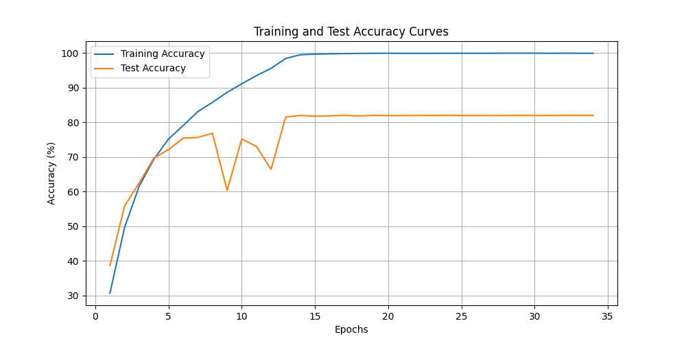
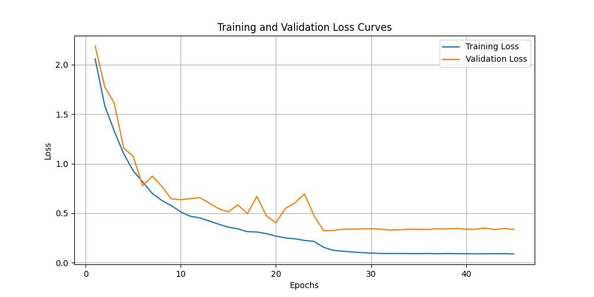
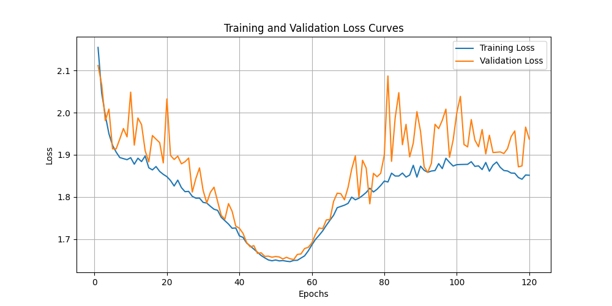
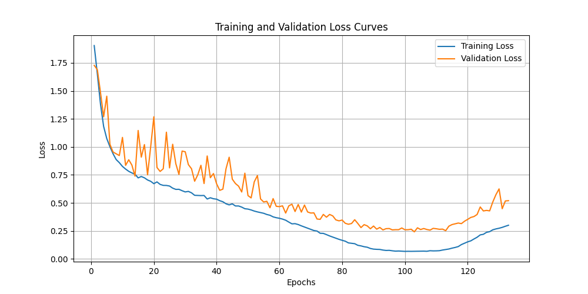
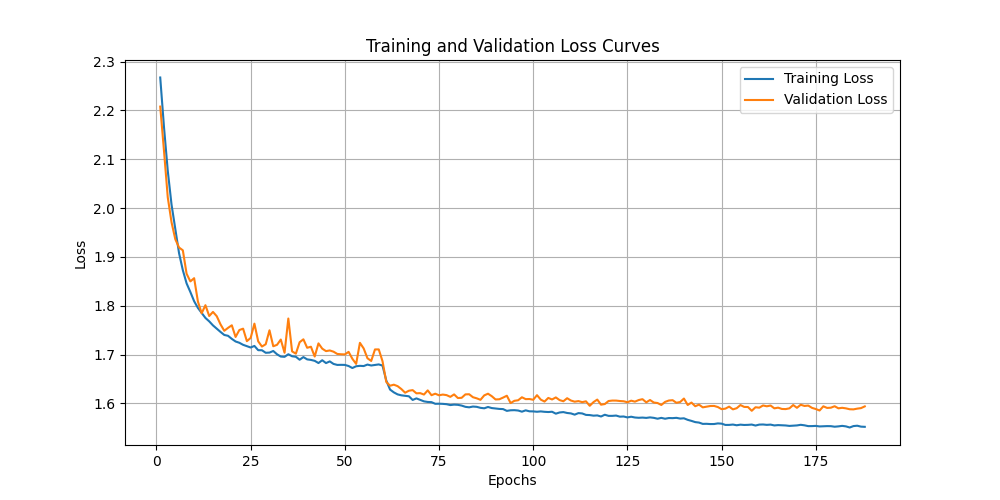

# Lab1 Task2 CNN
22300240022 王镜凯

## MINIST网络结构
```python
class MNISTNet(nn.Module):
    """
    MNIST数据集的CNN模型
    包含2个卷积层和2个全连接层，使用dropout进行正则化
    """
    def __init__(self):
        super(MNISTNet, self).__init__()
        self.conv1 = nn.Conv2d(1, 32, kernel_size=3, stride=1, padding=1)
        self.conv2 = nn.Conv2d(32, 64, kernel_size=3, stride=1, padding=1)
        self.dropout1 = nn.Dropout(0.25)
        self.dropout2 = nn.Dropout(0.5)
        self.fc1 = nn.Linear(64 * 14 * 14, 128)  
        self.fc2 = nn.Linear(128, 10)

    def forward(self, x):
        x = self.conv1(x)
        x = F.relu(x)
        x = self.conv2(x)
        x = F.relu(x)
        x = F.max_pool2d(x, 2)
        x = self.dropout1(x)
        x = torch.flatten(x, 1)
        x = self.fc1(x)
        x = F.relu(x)
        x = self.dropout2(x)
        x = self.fc2(x)
        return F.log_softmax(x, dim=1) 
```
### 数据增强
> 更平滑


无数据增强
> 抖动更剧烈


### 学习率优化
统一用0.01作为learning rate最后测试集上准确率只能达到99.08%
再改为分阶段的学习率之后，测试集准确率上升至99.22%
```python
optimizer = optim.SGD(model.parameters(), lr=LEARNING_RATE, momentum=0.9, weight_decay=0.0001)
# 添加学习率调度器
scheduler = optim.lr_scheduler.MultiStepLR(optimizer, milestones=[10, 20], gamma=0.1)
```
### 不同卷积核大小尝试
> 详见task3 report
一开始采用的卷积核大小为3，准确率99.2%左右，最后在尝试kernel size为6或者10时，准确率达到了99.5%+，猜测原因是自己写的CNN网路深度小，这时候采用较大的卷积核可以获得更大的感受野，在浅网络上可能更大的kernel size表现会更好

## cifar10 网络结构
### CNN
> 尝试了自己写的CNN，VGG-16，VGG-19，最后在VGG-16上调出了比较好的表现（测试集上94.11%），比目前网上的VGG（包括19在内）表现都要好1到2个百分点
### vgg-16 网络结构详解
- 输入层：接受一个224x224x3的RGB图像。

- 第一部分：包含两个64通道的卷积层，后接一个最大池化层。

- 第二部分：包含两个128通道的卷积层，后接一个最大池化层。

- 第三部分：包含三个256通道的卷积层，后接一个最大池化层。

- 第四部分：包含三个512通道的卷积层，后接一个最大池化层。

- 第五部分：同样包含三个512通道的卷积层，后接一个最大池化层。

- 全连接层：三个全连接层，前两个有4096个节点，最后一个有1000个节点，用于输出1000个类别的预测。
### 数据增强
> 有效防止过拟合

```python
if aug_choice == 'y' or aug_choice == 'Y':
    use_augmentation = True
    print("Using data augmentation...")
    train_transform = transforms.Compose([
        transforms.ToPILImage(),
        transforms.RandomCrop(32, padding=4),
        transforms.RandomHorizontalFlip(),
        transforms.ToTensor(),
        transforms.Normalize((0.4914, 0.4822, 0.4465), (0.2023, 0.1994, 0.2010)),
        transforms.RandomErasing(p=0.5)  # 移到ToTensor之后
    ])
```
随机裁剪图像为 32x32 大小，同时在裁剪前对图像四周填充 4 个像素，相当于在图像边缘加上一圈，这样裁剪后仍是 32x32，但带有一定“偏移”，模拟不同位置。

以 50% 概率对图像进行左右翻转，有助于增强模型对左右方向的鲁棒性（常用于图像分类任务）。

随机擦除操作：以 50% 的概率随机遮盖图像的一部分，相当于引入遮挡或遮盖物干扰，可以提升模型的鲁棒性。

### 学习策略的选择
第一次选用了余弦退火但是在vgg-19上表现不好，容易早早的过拟合，然后因为过大的学习率导致后续loss一路上升


后来改为分阶段的学习策略，在第一次到达最低点时，改用更小的学习率
```python
# 使用阶段性学习率调度
def lr_schedule(epoch):
    if epoch < WARMUP_EPOCHS:
        return LEARNING_RATE * (epoch + 1) / WARMUP_EPOCHS
    elif epoch < INITIAL_STAGE:
        return LEARNING_RATE
    elif epoch < FINAL_STAGE:
        return LEARNING_RATE * 0.1
    else:
        return LEARNING_RATE * 0.01

scheduler = optim.lr_scheduler.LambdaLR(optimizer, lr_lambda=lr_schedule)
print("Using stage-wise learning rate schedule for VGG19")
```
优化效果显著

- vgg-16


- vgg-19


### 权重衰减

加入weight_decay
作用原理：
- 在损失函数中添加一个惩罚项，这个惩罚项是所有模型参数的L2范数
- 数学表达式：Loss = Original_Loss + λ * Σ(w²)
- 其中λ就是weight_decay参数，w是模型的权重参数

有效防止过拟合

### 测试结果
```bash
Loading model: vgg16_cifar10_aug_best.pth
Model VGG16 with augmentation loaded successfully
Starting evaluation...

Test results:
Model: VGG16 with augmentation
Average loss: 0.2116
Overall accuracy: 9411/10000 (94.11%)

Class accuracy:
airplane: 94.90%
automobile: 98.10%
bird: 92.10%
cat: 86.60%
deer: 94.90%
dog: 89.40%
frog: 96.00%
horse: 96.60%
ship: 96.40%
truck: 96.10%
```