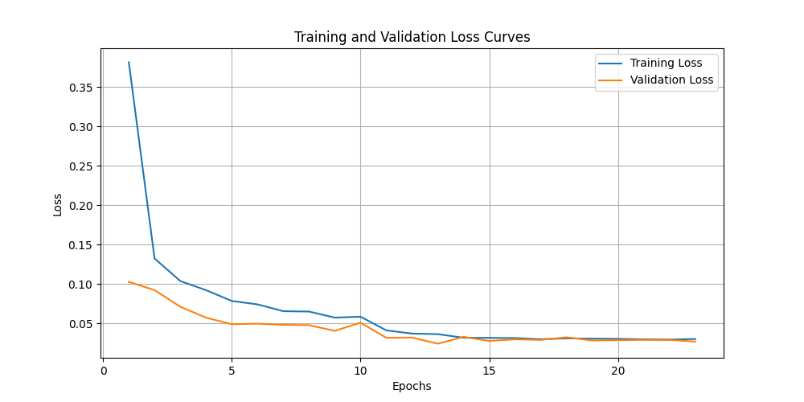
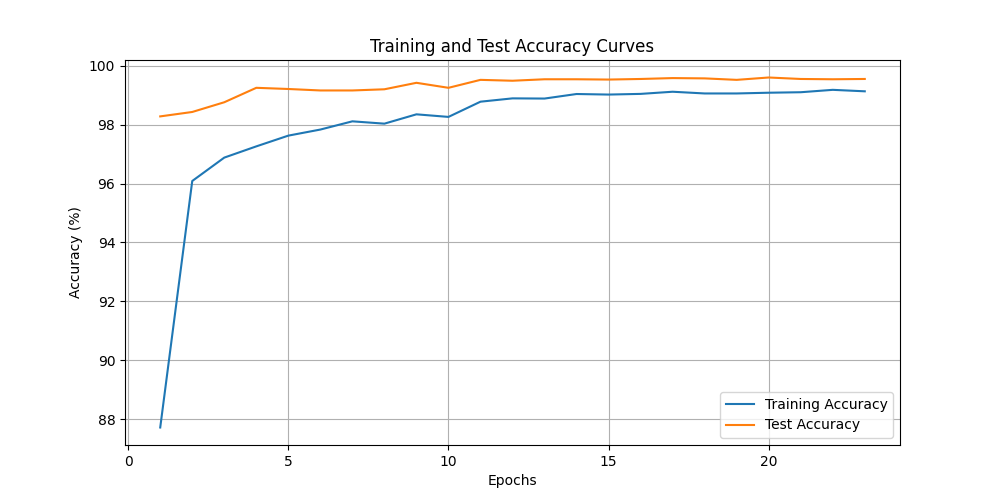
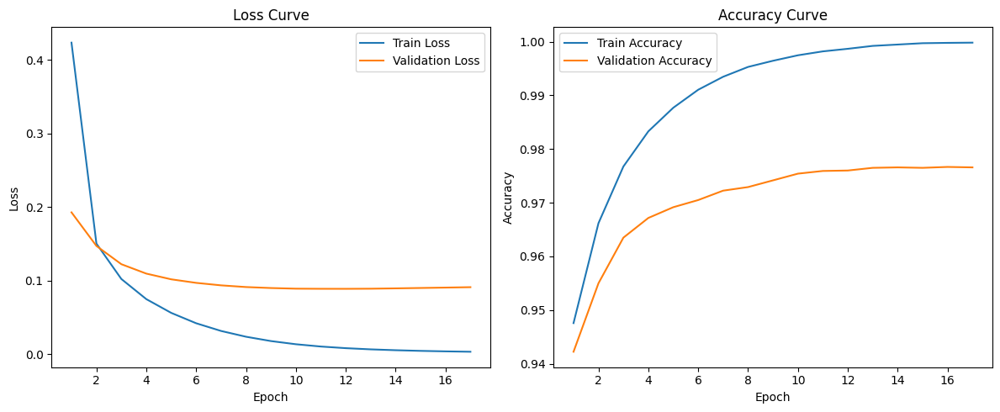
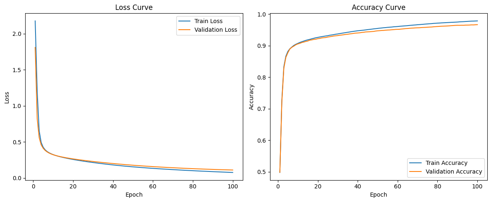
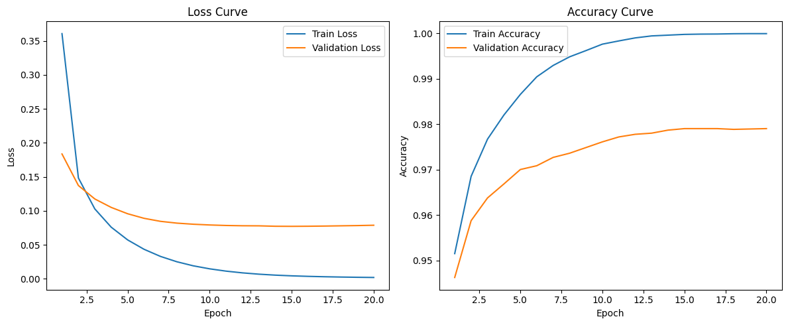
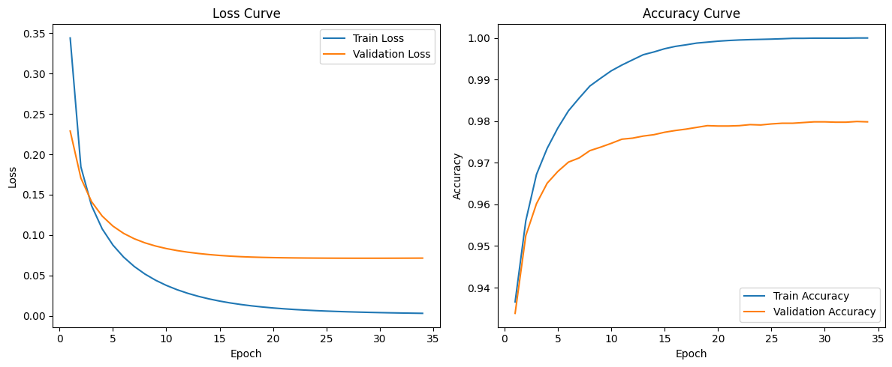
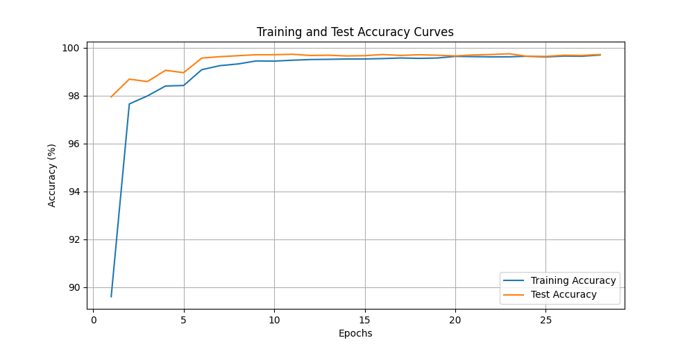
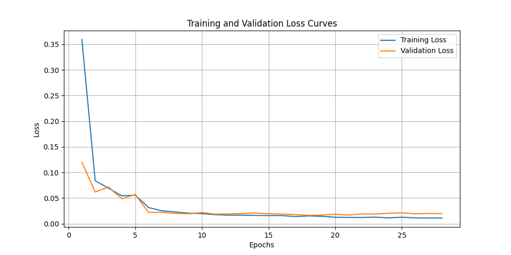
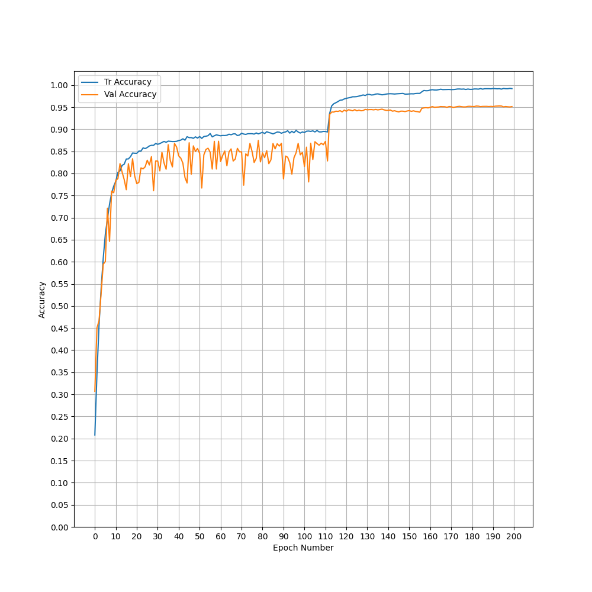
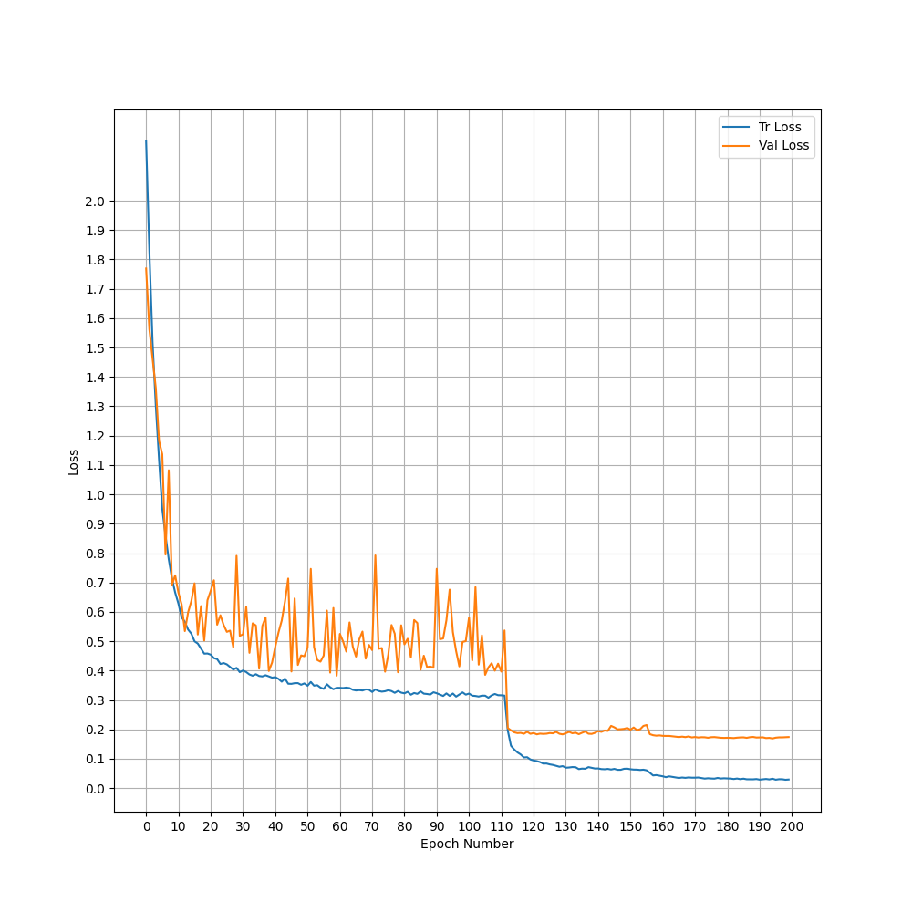

# Lab1 Task3 超参数调优、消融实验与ResNet
## BP超参数调优
学习率（3种）、batch size(4种)、参数初始化方式（3种）
```python
# 超参数网格搜索
learning_rates = [0.1, 0.01, 0.001]
batch_sizes = [32, 64, 128, 256]
init_methods = ['he', 'xavier', 'standard']
```

He 初始化（He Initialization）
特点：专为 ReLU 激活函数设计，能够有效缓解梯度消失问题。

方法：权重初始化为服从均值为 0、方差为 $( \frac{2}{\text{fanin}} )$ 的正态分布或均匀分布，其中 $fan_{in}$ 是输入神经元的数量。
优势：适用于深层网络，尤其是使用 ReLU 或其变体作为激活函数的网络。

Xavier 初始化（Xavier Initialization）

特点：适用于 Sigmoid 和 Tanh 激活函数，旨在保持前向传播和反向传播时的信号方差一致。

方法：权重初始化为服从均值为 0、方差为 $( \frac{1}{\text{fanin} + \text{fanout}} )$ 的正态分布或均匀分布，其中 fan_in 和 fan_out 分别是输入和输出神经元的数量。

优势：在浅层和中等深度的网络中表现良好。

Standard 初始化（标准初始化）

特点：通常指随机初始化，权重从标准正态分布（均值为 0，方差为 1）中采样。
方法：没有针对特定激活函数或网络深度进行优化。

劣势：在深层网络中可能导致梯度消失或爆炸问题。
> 测试方法：测试3 * 4 * 3种方法的组合，测试10轮训练之后在验证集上的表现（较为不严谨，但是省时间，训完整一轮还是要好久...）

```python
for lr in learning_rates:
    for bs in batch_sizes:
        for init in init_methods:
            print(f'\nTesting lr={lr}, batch_size={bs}, init={init}')
            
            # 初始化模型
            network = NeuralNetwork(init_method=init)
            n_batches = X_train.shape[0] // bs
            
            # 训练5个epoch来快速评估参数组合
            for epoch in range(10):
                total_loss = 0
                for i in range(n_batches):
                    batch_x = X_train[i * bs:(i + 1) * bs]
                    batch_y = y_train_onehot[i * bs:(i + 1) * bs]
                    total_loss += network.train_step(batch_x, batch_y, lr)
                
                val_acc = network.evaluate(X_val, y_val)
                print(f'Epoch {epoch + 1}: Loss {total_loss/n_batches:.4f}, Val Acc {val_acc:.4f}')
                
                if val_acc > best_val_acc:
                    best_val_acc = val_acc
                    best_params = {
                        'learning_rate': lr,
                        'batch_size': bs,
                        'init_method': init
                    }
```
最后找到的最优方法如下
- Best parameters found:
- Learning rate: 0.1
- Batch size: 32
- Init method: he

在该方法下最后测试集上准确率：98.07%
## CNN超参数调优（MNIST任务下）
### 不同卷积核大小
- kernel size 全部为2
```
Test set: Average loss: 0.0236, Accuracy: 9914/10000 (99.14%)
```
- kernel size 全部为3（default）
> 准确率参考task2 report(99.22%)

- kernel size 全部为6
> 准确率：99.52%

- kernel size 全部为10 
> 准确率: 99.54%



思考：在我自己设计的CNN中，卷积层较少，此时采用更大的卷积核可以获得更大的感受野，因此表现可能会更好。
### 不同卷积层数
> task2 中已经尝试
尝试了自己写的CNN，vgg16，vgg19，不带残差网络的ResNet18

其中自己写的CNN最浅，比较容易过拟合，泛化性不高（准确率：88%）

vgg19和ResNet18深度较深，超参数有点难以选择最终准确率都徘徊在99.2%左右

vgg16表现最好，在选择了合适的学习策略之后，达到了99.4%的准确率（在纯CNN网络上成绩较好）

### 不同步长
> 固定kernel size为3，采用同样的学习策略

- stride = 1（default）
准确率: 99.2%

- stride = 3
准确率：98.4%

- stride = 5
准确率：43.34%（难以收敛）

MNIST每张图片的像素很少（28*28），若采用大的步长容易跳过很多细节，甚至导致模型难以收敛

### 不同池化方式
> 固定kernel size为3，stride为1

max_pool(default)准确率：99.38%
- 优点：
保留图像中的纹理特征和边缘信息，对局部特征特别敏感。
能有效抑制背景噪声，突出重要特征。
- 缺点：
会忽略非最大值的信息，可能损失一些细节。

avg_pool 准确率：99.37%
- 优点：
保留更多整体信息，输出更平滑。
对特征不那么激烈的任务表现较好，如平滑输出、图像压缩等。
- 缺点：
容易模糊特征边界，可能削弱关键信息。

在这个任务上似乎avg_pool和max_pool没什么大区别
## 不同激活函数(MNIST任务下)
- ReLU(default)


- Sigmoid

收敛慢很多(100+epochs)，因为函数导致梯度小

- LeakyReLU

效果和ReLU差不多，略好于ReLU，收敛速度快
- tanh

效果还可以，准确率在这几个激活函数中最高（98.02%）

## CNN网络加入dropout
> 已经在task2中加入，详情请看task2 report，准确率表现有0.2%左右的提升
## BP网络加入dropout
> 固定lr为0.1

添加Dropout类
```python
class Dropout:
    def __init__(self, drop_prob=0.5):
        self.drop_prob = drop_prob
        self.mask = None
        self.training = True

    def forward(self, x):
        if self.training:
            self.mask = (np.random.rand(*x.shape) > self.drop_prob).astype(np.float32)
            return x * self.mask / (1.0 - self.drop_prob)
        else:
            return x

    def backward(self, grad):
        if self.training:
            return grad * self.mask / (1.0 - self.drop_prob)
        else:
            return grad

    def update(self, learning_rate):
        pass  # No parameters to update

    def train(self):
        self.training = True

    def eval(self):
        self.training = False

```


- 加dropout之前准确率：97.82%
- 加dropout之后准确率：97.96%（dropout: 20%）

## MNIST(ResNet)
训练结果：


### 网络框架
准确率：99.71%
## cifar-10(ResNet)


准确率：95.70%
### 网络框架
## ResNet网络框架
